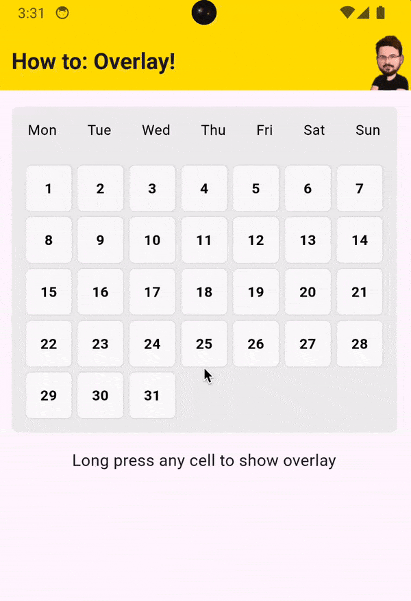

# Flutter Overlay Demo

A demonstration of how to create a position-anchored overlay with a backdrop cutout in Flutter.

This demo shows how to implement an overlay system that can highlight specific UI elements while
dimming the rest of the
screen.

<a href="https://share.helgesver.re/dd1tj0cJ">

</a>

## Features

- 📍 Position-anchored overlays
- 🎨 Backdrop with cutout effect
- 🎯 Smart positioning based on screen space
- ✨ Smooth fade animations
- 📱 Screen boundary awareness
- 🔄 Proper state management

## Getting Started (With FVM)

If you don't use [FVM](https://fvm.app/documentation/getting-started), you can skip to the next
section.

```shell

# Clone the repository
git clone https://github.com/HelgeSverre/flutter-overlay-demo

# Navigate to the project directory
cd flutter-overlay-demo

# Set the Flutter version to use 
fmv use 

# Install dependencies
fvm flutter pub get

# Run the app
fvm flutter run
```

## Getting Started (Without FVM)

```shell
# Clone the repository
git clone https://github.com/HelgeSverre/flutter-overlay-demo

# Navigate to the project directory
cd flutter-overlay-demo

# Install dependencies
flutter pub get

# Run the app
flutter run
```

## How It Works

The demo showcases a calendar interface where tapping/long-pressing a day cell shows an overlay with
additional information.

The overlay includes:

- Semi-transparent backdrop
- Cutout effect around the selected cell (hole) and a border highlight around the hole
- Smart positioning of the "overlay card" based on screen position (aka it moves to the left if the
  selected cell is on the right edge of the screen, etc.)

## Learn More

Check out the full article explaining the implementation details:
[Creating Position-Anchored Overlays in Flutter](https://helgesver.re/articles/flutter-anchored-overlay-cutout-backdrop)

## License

This project is licensed under the MIT License - see the [LICENSE](LICENSE.md) file for details.
